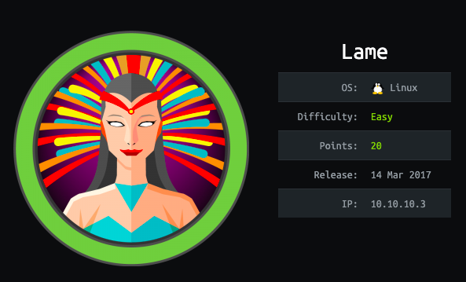
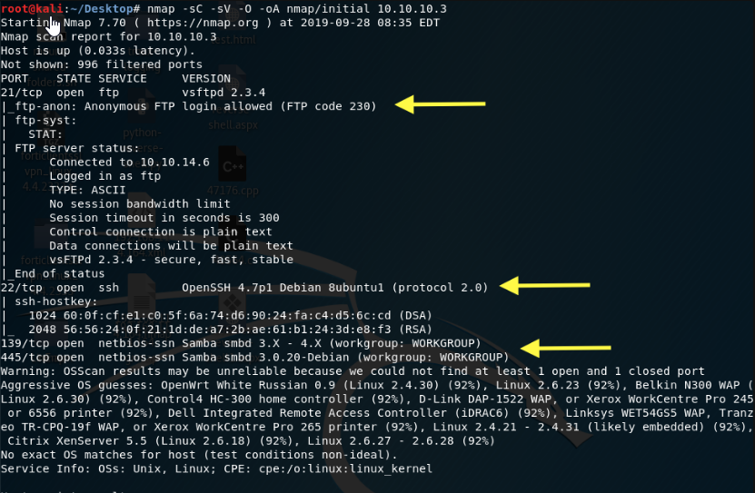

# lame




nmap -sV -sS&#x20;

```
nmap -sV -sS        k        ki        ooi     
```

kjnkkbjn    &#x20;

> thats it&#x20;

## yes&#x20;



thb



be carful &#x20;



hack the box ac ademy




[metasploit](https://rana-khalil.gitbook.io/hack-the-box-oscp-preparation/linux-boxes/lame-writeup-w-o-metasploit)


[rana](https://rana-khalil.gitbook.io/hack-the-box-oscp-preparation/linux-boxes/lame-writeup-w-o-metasploit)


[1337x](https://www.1377x.to)




